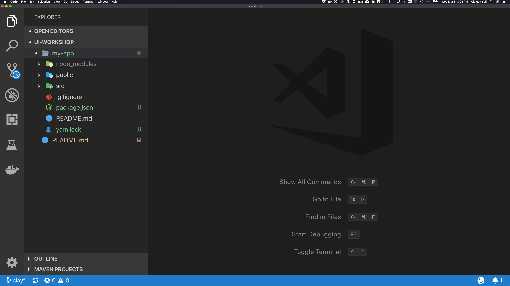

# ui-workshop

## Front End Developer Environment

1. OS, most front-end is done in macOS environments, but Windows is fine also, recommend trying out [PowerShell](https://github.com/PowerShell/PowerShell) for a better terminal experience instead of `cmd.exe`.
2. Install [nodejs LTS](https://nodejs.org/en/) if you don't have it already.
    * If you would like to use multiple versions of `npm` on your computer, use [nvm](https://github.com/creationix/nvm#installation) or [nvm-windows](https://github.com/coreybutler/nvm-windows#node-version-manager-nvm-for-windows) that allows you to quickly switch between npm versions if you have older projects that you prefer to use previous versions with.
3. Install [VS Code](https://code.visualstudio.com/)
    * Open source but managed by Microsoft. It is a light weight IDE that is tailored to front end development with ES6, TypeScript and lots of useful plugins.
4. Recommended Purchase - Install [Tower](https://www.git-tower.com)
    * This is a very powerful and user-friendly GUI Git client. I use it for everything.

### package.json

* `npm` - This is our package manager. But we also use it to execute node scripts to run and build apps. **Grunt** and **Gulp** are less commonly used now days to execute.
  * `package.json` is maintained by `npm` or `yarn`.
  * `package-lock.json` is used to lock us into the precise versions of our dependencies. This file is checked-in to our repositories and ensures that all developers build matching `./node_modules`. Yarn uses `yarn.lock`.
* `yarn` - [yarn](https://yarnpkg.com/en/) is just an alternative to using `npm` to install dependencies in `package.json`. It was popular because it introduced `yarn.lock` file to ensure that multiple developers stay in-sync with exact versions of their dependencies. It is a little less popular now since `npm` introduced `package-lock.json`.
* `nvm` - [nvm](https://github.com/creationix/nvm#installation) is a helpful tool to switch between multiple versions of nodejs/npm on your machine.
* `npx` - A Package runner that is included with `npm`.

### create-react-app

Visit https://github.com/facebook/create-react-app. This is project allows you to jumpstart a new React application in a few commands. Please try this out on your machine.

    # to create your own react app
    npx create-react-app my-app

    # start existing react app
    cd my-app
    npm install
    npm start

Open this repository folder with your VS Code IDE.

### VS Code Plugins

Click on the Plugins icon  on the left side panel, and install/enable the **Recommended** plugins. Here are some useful ones:

* ESLint
* Beautify
* EditorConfig for VS Code
* markdownlint
* Visual Studio IntelliCode - Preview

### .editorconfig

* I drop this file [.editorconfig](.editorconfig) into all of my projects.
* You must enable the plugin [EditorConfig for VS Code](https://marketplace.visualstudio.com/items?itemName=EditorConfig.EditorConfig).
* This file helps multiple developers stay consistent with [Tabs vs. Spaces](https://www.businessinsider.com/tabs-vs-spaces-from-silicon-valley-2016-5) and character encoding (*UTF-8*).
* Other IDEs support this file, not just VS Code.
* Hint: Two spaces is the correct answer :)
